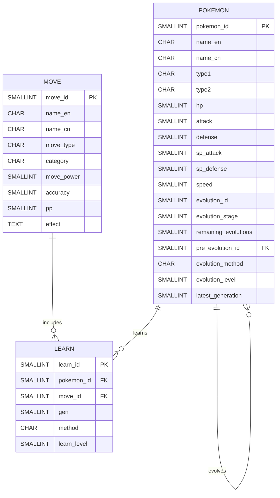

# 项目报告

**概览：** 本文档汇总了基于初代151只宝可梦的数据工程工作：包括项目背景、目标、数据来源、数据库设计（ER 图与表结构）、ETL 流程（采集/清洗/导入）以及若干 SQL 查询示例与分析结果。所有代码与原始/中间数据位于仓库中，关键实现分布在 `data/`、`src/`、`sql/`中。

**1. 项目背景**

《宝可梦》（Pokémon）作为全球最具影响力的游戏 IP 之一，经过九个世代的持续更新，已拥有超过一千种宝可梦和上千种招式。随着版本迭代，宝可梦的种族值、属性、招式威力以及技能学习方式均可能发生调整，使得数据规模不断扩大、结构日益复杂。对于玩家而言，宝可梦与技能之间形成了典型的多对多关系，并伴随着版本演化、形态变化和多种技能获取方式，这些特点使其成为数据库设计与数据工程实践的典型应用场景。

目前，宝可梦相关数据主要分散于多个在线资料库，虽然信息丰富，但缺乏统一的数据组织形式，不利于进行批量查询、统计分析和数据挖掘。因此，本项目拟以初代151只宝可梦为研究对象，构建一个关系型数据库，对宝可梦基本信息、招式信息以及技能学习关系进行统一建模，并通过数据采集、清洗、转换（ETL）和 MySQL 数据库存储，实现数据的规范化管理。

考虑到不同宝可梦在各世代中的可用性存在差异，本项目采用“最新可用世代”的数据标准，即对于每只宝可梦，优先使用第九世代（《朱／紫》）的数据；若该宝可梦未出现在第九世代，则使用其最近一次可用世代的数据，以保证数据来源的一致性和现实参考价值。在数据库构建完成后，可进一步支持技能覆盖分析、属性统计、技能池分析以及其他可视化展示，为数据库设计、SQL 查询优化和数据分析提供一个具有实际应用背景的数据集。

**2. 项目目标**

- 统一聚合初代151宝可梦在最新世代的招式学习信息；
- 为每只宝可梦与每个招式构建规范化表结构（关系型数据库）；
- 提供清洗与转换（ETL）过程的可复现代码（Notebook / 脚本）；
- 实现若干典型的 SQL 查询，展示数据分析能力（如招式覆盖、类型分布、学习方式统计等）。

**3. 数据来源**

项目初期曾计划采用 PokéAPI 作为数据来源（对应pokemon151_v1.csv）。PokéAPI 提供了结构化的 RESTful API，能够方便地获取宝可梦、招式、属性及进化等基础信息，接口格式统一，便于程序自动调用，十分适合作为数据库初始化的数据来源。

然而，在实际调研过程中发现，由于宝可梦系列历经多个世代，部分宝可梦、招式及学习方式在不同版本中发生了调整，而 PokéAPI 只提供了在某个时间节点的数据，过于老旧且没有维护和更新，在技能学习记录和不同世代数据的组织上存在一定局限，难以直接满足本项目以“最新可用世代”为统一标准的数据需求。

经过比较后，项目最终选择 Pokémon Database（PokemonDB） 作为主要数据来源（对应除pokemon151_v1.csv外的其余数据）。该网站以游戏当前版本为基础维护数据，并按照不同世代分别整理了宝可梦技能学习列表、招式信息及种族值等内容，能够较准确地反映各宝可梦在对应世代的实际可用数据。同时，PokemonDB 对于未收录于第九世代的宝可梦仍保留其最近可用世代的数据，符合本项目“优先采用第九世代，若不存在则采用最近可用世代”的数据采集原则。

因此，本项目最终采用 Python 对 Pokémon Database 网页进行数据采集，并结合数据清洗与格式转换流程，生成宝可梦（pokemon）、招式（move）以及技能学习关系（learn）三类数据，避免了不同平台之间因数据维护策略差异而造成的数据不一致问题。

**4. 数据库设计**

本项目使用关系型模型，核心实体包括：`pokemon`、`move` 与 `learn`（关联表）。设计原则为：字段尽量原子化、使用外键保证参照完整性、为常用查询添加索引以提升性能。

ER 图（简化视图，使用 Mermaid）：



表结构要点：

- `pokemon`： `pokemon_id`（主键，对应图鉴编号）、`name_en`，`name_cn`（中英名称）、`type1`、`type2`（属性，第二个可以为空）、基础种族值字段 `hp, attack, defense, sp_atk, sp_def, speed`、`evolution_id`（表示进化链的id）、`evolution_stage`（表示当前进化阶段）、`remaining_evolutions`（表示还可以进化的阶段，可以为空）、`pre_evolution_id`（外键，指向前一个进化阶段的id，可以为空），`evolution_method`（进化方式）、`evolution_level`（进化时的等级，如果进化方式就填0，表示任意），`latest_generation` （表示数据对应的最新世代）；
- `move`：`move_id`（主键）、`name_en`、`name_en`（名称）、`move_type`（招式属性）、`category`（物理/特殊/变化）、`move_power`（威力，若为空则表示无固定威力）、`accuracy`（命中率，若为空则表示必定命中，若无-1则表示命中率无限）、`pp`（可使用次数）、`effect`（效果）；
- `learn`：`learn_id`（主键）、`pokemon_id`（外键 -> `pokemon.id`）、`move_id`（外键 -> `move.id`）、`gen`（学会的世代）、`method`（学习方式，如 `level-up`、`tm`、`tutor`）、`learn_level`（0代表任意等级）。

索引建议：

- 在 `learn(pokemon_id)` 与 `learn(move_id)` 上建立索引以加速连接查询；
- 在 `move(type)`、`pokemon(pokemon_id)` 上建立索引用于过滤查询。

实现位置： `sql/database_creating.sql`，包含列定义与外键约束。

**5. ETL 流程**

本项目采用典型的 ETL（Extract–Transform–Load）流程进行数据构建，整体分为数据采集（Fetch）、数据清洗（Clean）和数据导入（Load）三个阶段。整个流程均通过 Notebook 与 Python 脚本实现，可保证数据处理过程具有良好的可复现性

**（1）数据采集**
数据采集阶段主要由 `src/fetch_*` 系列 Notebook 与 Python 脚本完成，负责从原始数据来源获取宝可梦及招式相关信息。数据来源为 https://pokemondb.net/ 。采集过程中首先对原始数据进行初步整理，对字段名称、数据格式及编码方式进行统一，使不同来源的数据具有一致的结构，并最终生成标准化的 CSV 或 JSON 文件，保存至 data/raw/ 目录，为后续的数据清洗提供统一的数据输入。

**（2）数据清洗**
数据清洗阶段主要在 `src/data_cleaning_v1.ipynb` 中完成，是整个项目最核心的数据处理环节。首先，对原始数据进行字段类型转换，并处理特殊取值，例如将无固定威力的招式 power 设置为空值，将命中率显示为特殊符号的数据统一转换为 -1，以便后续数据库存储与查询。

随后，对数据进行重复记录检查与去重处理。项目遵循**“最新可用世代”**原则，对于同一宝可梦或同一招式在多个世代中的重复记录，仅保留最新世代的数据，从而避免不同版本之间的信息冲突。同时，以 pokemon_id、move_id 和 method 为联合依据检测重复学习记录，在删除重复数据后重新生成连续的 learn_id，保证主键编号的完整性。

完成基础清洗后，将数据进一步转换为符合关系型数据库规范的数据结构，将原始数据拆分为主表与关联表，并删除数据库设计中不再需要的冗余字段。例如，宝可梦数据中的 `post_evolution_id` 字段会导致与进化关系表形成重复外键，在数据库导入过程中容易产生约束冲突，因此在转换阶段将其移除。此外，根据整理后的招式学习情况，对宝可梦表中的 latest_generation 字段进行更新，以准确反映每只宝可梦最后一个拥有有效招式学习数据的游戏世代。需要说明的是，部分宝可梦虽然未出现在最新世代中，但其招式数据仍保留在游戏文件中，因此该字段并不完全等同于宝可梦实际登场的最新世代。

**（3）数据导入**
完成数据清洗后，首先使用 sql/database_creating.sql 创建数据库及各关系表的结构，包括主键、外键及必要的约束条件。随后，通过 data_loading.ipynb 使用 pymysql 库结合自定义的 import_csv_to_table 函数，将 data/processed/ 目录中的各类 CSV 文件批量导入 MySQL 数据库。

由于前期已经完成字段规范化、数据清洗及关系转换，导入过程无需进行额外的数据修正，即可顺利完成关系型数据库的构建，为后续 SQL 查询、统计分析及数据可视化提供可靠的数据基础。

关键清洗要点与决策记录：

- 对于世代选择，采用“最新可用世代”原则，避免对同一宝可梦在不同世代出现重复冲突数据；
- 以`pokemon_id`、`move_id`、`method`为依据检查重复行，删去后重新排列`learn_id`；
- 对招式威力和命中率非数值的数据进行处理；
- 根据学习情况更新宝可梦的`latest_generation`（这是因为对于最新世代的不可用宝可梦仍可能在游戏中保留其技能数据）。

实现位置：

- 抓取代码：`src/fetch_move_v2.ipynb`, `src/fetch_pokemon_v3.ipynb`；
- 清洗代码：`src/data_cleaning_v1.ipynb`；
- 导入示例：`sql/data_loading.ipynb` 与 `sql/database_creating.sql`。

**6. SQL 查询与分析（项目成果示例）**

下面给出若干在该数据库上可运行的典型 SQL 查询示例，并对每个查询给出简要分析说明。

- 查询 1：统计每种学习方式（method）拥有的招式数量（按 `move.method` 聚合）

```sql
SELECT method, COUNT(*) AS cnt
FROM learn
GROUP BY method;
```

分析：评估各类获取方式的占比，评估哪种方式较为重要

- 查询 2：统计每种属性（type）拥有的招式数量（按 `move.type` 聚合）

```sql
SELECT 
    move_type,
    COUNT(*) AS count,
    ROUND(COUNT(*) * 100.0 / SUM(COUNT(*)) OVER(), 2) AS pct
FROM move
GROUP BY move_type
ORDER BY count DESC;
```

分析：可视化属性上的招式分布，识别高密度属性（如普通、超能等）。

- 查询 3：找出学习招式最多的前十只宝可梦

```sql
SELECT
    p.name_cn,
    p.type1,
    COUNT(DISTINCT l.move_id) AS move_count
FROM pokemon p
JOIN learn l ON p.pokemon_id = l.pokemon_id
GROUP BY p.pokemon_id, p.name_cn, p.type1   
ORDER BY move_count DESC
LIMIT 10;
```

分析：展示基础招式池大小，便于理解某些宝可梦的技能覆盖能力。

- 查询 4：各属性宝可梦平均技能数

```sql
SELECT
    pokemon_type,
    ROUND(AVG(move_count), 2) AS avg_moves
FROM
(
    -- 第一属性
    SELECT
        p.pokemon_id,
        p.type1 AS pokemon_type,
        COUNT(DISTINCT l.move_id) AS move_count
    FROM pokemon p
    JOIN learn l
        ON p.pokemon_id = l.pokemon_id
    GROUP BY
        p.pokemon_id,
        p.type1

    UNION ALL

    -- 第二属性
    SELECT
        p.pokemon_id,
        p.type2 AS pokemon_type,
        COUNT(DISTINCT l.move_id) AS move_count
    FROM pokemon p
    JOIN learn l
        ON p.pokemon_id = l.pokemon_id
    WHERE p.type2 IS NOT NULL
      AND p.type2 <> ''
    GROUP BY
        p.pokemon_id,
        p.type2
) AS t
GROUP BY pokemon_type
ORDER BY avg_moves DESC;
```

分析：统计不同属性宝可梦学会技能数量的均值，展现属性间的差异。

实现位置： `data_visualization.ipynb` ，包含更多查询分析示例和完整可视化代码

**项目成果与改进思路**

- 已完成：数据清洗与关系型建模，基本 ETL Notebook 与建表脚本；
- 改进思路：
    - 完善特殊形态
    - 增加游戏作品维度
	- 补充 `type` 规范化表以便更复杂的多对多类型分析；
- 建议下一步工作：
	- 增加测试用例（如小型单元测试）以保证 ETL 在更改后仍能稳定运行；
	- 扩展至完整世代（不局限初代）以做更广泛的历史比较分析。


**参考文献**

[1]Wes McKinney. Python for Data Analysis: Data Wrangling with pandas, NumPy, and Jupyter [M]. O’Reilly Media, 2022.
[2]Elmasri R, Navathe S B. Fundamentals of Database Systems (7th Edition) [M]. Pearson, 2016.